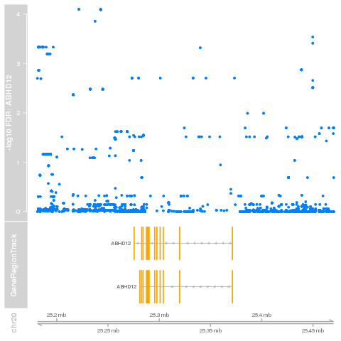

<!--
%\VignetteEngine{knitr::knitr}
%\VignetteIndexEntry{Cloud-enabled cis-eQTL searches with Bioconductor GGtools 5.x}
-->

<h1>Cloud-enabled cis-eQTL searches with GGtools 4.10+</h1>

* [Background](#background-sec)
* [Objectives](#objectives-sec)
    * [Basic reporting](#reporting-sec)
    * [Visualization](#viz-sec)
* [Raw materials: structuring expression, genotype, and sample data](#rawdata-sec)
* [Cluster management with starcluster](#starcluster-sec)
* [Programming the parallel search](#parallel-sec)
    * [High level interface](#hilevel-sec)
    * [Preparing to call All.cis: setup and handling of value](#exec-sec)
* [Working with the results](#results-sec)
    * [Visualizing results for a gene](#gviz-sec)
    * [Statistical characteristics of search results](#stats-sec)

<h2 id="background-sec">Background</h2>

```{r echo=FALSE,results="hide"}
date()
```
```{r echo=FALSE,results="hide"}
suppressPackageStartupMessages({
library(knitcitations)
library(bibtex)
allbib = read.bibtex("allbib.bib")
library(GGtools)
library(yri1kgv)
library(snpStats)
library(scatterplot3d)
library(lumi)
library(parallel)
library(foreach)
library(biglm)
library(rmeta)
})
```

Numerous studies have employed genome-wide measures of mRNA abundance (typically
assayed using DNA microarrays, and more recently RNA-seq) in combination with
high-resolution genotyping (often supplemented with statistical imputation to
loci not directly assayed, leading to genotype calls with quantified uncertainty)
to search for genetic determinants of variation in gene expression. 
Key references in human applications include 
`r citet(allbib[["Cheung:2005p446"]])`,
`r citet(allbib[["Majewski:2011p3139"]])`, and 
`r citet(allbib[["Gaffney:2012p5397"]])`;
`r citet(allbib[["Shabalin:2012p4753"]])` addresses computational concerns.

This document focuses on searches for eQTL <emph>in cis</emph>, so that
DNA variants local to the gene assayed for expression are tested for association.

A typical report describes tuning of the search (including, for example,
boundaries on minor allele
frequencies of variants to be tested, approach to correction for batch effects
and other forms of confounding, scope of search in terms of distance from gene
coding region), enumerates variants with evidence of association to expression
variation in nearby genes, and then characterizes the biological roles of the
discovered variants.

<h2 id="objectives-sec">Objectives</h2>

Suppose there are $N$ independently sampled individuals
with gene expression measures on $G$ genes or probes.
Each individual is genotyped (or has genotype statistically imputed) at $S$
DNA locations, catalogued by NCBI dbSNP or 1000 genomes.
We are given a $G \times N$
matrix of expression assay results, and $N \times S$ genotyping results
in the form of the number of B alleles (or expected number of B alleles)
for each of the loci.  Select the search radius $\rho$ (for example, 100kb) and
for each gene $g$, determine the search neighborhoods $N_g = N_{g,\rho} = [a_g-\rho, b_g+\rho]$,
where $a_g$ denotes the genomic coordinate of the 5' end of the transcript region for
gene $g$, and
$b_g$ is the coordinate at the 3' end.  Let $|N_g|$ denote
the number of SNP in that neighborhood.   Key objectives are

- For each gene, compute the $|N_g|$ test statistics
measuring association of SNPs in $N_g$ with mean expression of gene $g$;
- Obtain a measure of statistical significance for each test statistic;
- Support adjustment and assessment of sensitivity analysis of statistical
tests (e.g., adjustment for batch effects, effects of filtering on gene expression variation
or SNP minor allele frequency);
- Provide the test results in a format for ready interrogation using
various types of search key;
- Support visualization of associations at various scales.

<h3 id="reporting-sec">Basic execution/reporting structure</h3>

The code in the example for the GGtools function All.cis() yields an
example of a sharply restricted search for cis eQTL on chr21, using
data on the HapMap CEU population.  

```{r dolo,echo=FALSE}
load("f1.rda")
```
```{r lkex,eval=FALSE}
cc = new("CisConfig") # take a default configuration
chrnames(cc) = "21"   # confine to chr21
estimates(cc) = FALSE # no point estimates neede
f1 <- All.cis( cc )   # compute the tests; can be slow without attendance
                      # to parallelization
```
The result of the function inherits
from GRanges, and includes metadata concerning its generation.
```{r lookf1,echo=TRUE}
length(f1)
f1[1:3]
metadata(f1)
```
Use of GRanges for the organization of association test statistics allows
easy amalgamation of findings with other forms of genomic annotation.  Retention of
the association scores achieved under permutation allows recomputation of
plug-in FDR after combination or filtering.


<h3 id="viz=sec">Visualization examples</h3>

Targeted visualization of association is supported with
the plot_EvG function in GGBase.  To obtain the
figure on the right, the expression matrix
has been transformed  by removing the principal components
corresponding to the 10 largest eigenvalues.  This is a
crude approach to reducing ``expression heterogeneity'', a main
concern of eQTL analyses to date
`r citep(allbib[["Leek:2007p1723"]])`.

```{r demoy,fig=TRUE,fig.width=7,fig.height=4,echo=FALSE,results="hide"}
library(yri1kgv)
if (!exists("c20")) c20 = getSS("yri1kgv", "chr20")
par(mfrow=c(1,2))
plot_EvG(probeId("o67h4JQSuEa02CJJIQ"), rsid("rs2259928"), c20,
  main="observed expr.")
if (!exists("c20f")) c20f = clipPCs(c20, 1:10)
plot_EvG(probeId("o67h4JQSuEa02CJJIQ"), rsid("rs2259928"), c20f,
  main="10 expr. PC removed")
```

Above we have a single SNP-gene association.  
The family of
associations observed cis to ABHD12 can also be
visualized in conjunction with the transcript models. 




<h2 id="rawdata-sec">Raw materials: structuring expression, genotype, and sample data</h2>

<h3 id="SnpMatrix-sec">SnpMatrix from snpStats for called and imputed genotypes</h3>
As of November 2013, a reasonably efficient representation of expression, sample and
genotype data is defined using an R package containing
- an ExpressionSet instance, and
- a folder inst/parts containing genotype data as SnpMatrix instances, as defined in the snpStats package.

Elements of the sampleNames of the ExpressionSet instance must coincide with elements of the row names
of the SnpMatrix instances.  At time of analysis, warnings will be issued and harmonization attempts will be made
when the coincidence is not exact.

The SnpMatrix instances make use of a byte code for (potentially) imputed genotypes.
Each element of the code defines a point on the simplex displayed below, allowing
a discrete but rich set of the key quantities of interest, the expected number of B alleles.
```{r bag,fig=TRUE,fig.width=4,fig.height=4,echo=FALSE}
library(snpStats)
library(scatterplot3d)
tmp = as.raw(1:253)
yy = g2post(tmp)
EB = yy %*% c(0,1,2) 
scatterplot3d(yy[,1], yy[,3], EB, xlab="Pr(A/A)", ylab="Pr(B/B)", zlab="mean num. B")
```
Note that the nucleotide codes are not carried in this representation.  Typically for
a diallelic SNP, B denotes the alphabetically later nucleotide.

<h3 id="smlSet-sec">smlSet for coordinating genotype, expression, and sample-level data</h3>
We can illustrate the basic operations with this overall structure, using data collected
on Yoruban (YRI) HapMap cell
lines.  Expression data were obtained at ArrayExpression
E-MTAB-264 `r citep(allbib[["Stranger:2012p5427"]])`.

```{r bag2}
library(GGtools)
library(yri1kgv)
library(lumiHumanAll.db)
if (!exists("y22")) y22 = getSS("yri1kgv", "chr22")
y22
dim(exprs(y22))
fn = featureNames(y22)[1:5]
```
The annotation of expression features can be explored in several directions.
First, the probe names themselves encode the 50mers on the chip.
```{r getseq}
library(lumi)
id2seq(fn) # get the 50mer for each probe
# and some annotation
```
Second, the mapping to institutionally curated gene identifiers
is available.
```{r getann}
select( lumiHumanAll.db, keys=fn, keytype="PROBEID", columns=c("SYMBOL", "CHR", "ENTREZID"))
```
Finally, we can look at the genotype information.  This can be voluminous
and is managed in an environment to reduce potential copying expenses.
```{r getgen}
gt22 <- smList(y22)[[1]]  # access to genotypes
as( gt22[1:5,1:5], "character" )
cs22 = col.summary(gt22)  # some information on genotypes
cs22[1:10,]
```
<h2 id="starcluster-sec">Cluster management with starcluster</h2>

This workflow is based on Amazon EC2 computation managed using the
[MIT starcluster utilities](http://star.mit.edu/cluster/).  Configuration
and management of EC2 based machinery is quite simple.  The bulk of the partial run described here
used configuration variables
- CLUSTER_SIZE = 4
- NODE_IMAGE_ID = ami-a32b1dca
- NODE_INSTANCE_TYPE = c3.2xlarge # 8 cores, 15GB RAM on each
- MASTER_INSTANCE_TYPE = c3.2xlarge

In a complete run, for chromosome 1, a rescue run was required with a larger instance
type (m3.2xlarge).

<h2 id="parallel-sec">Programming the parallelized search</h2>

We will describe an approach to using a cluster to
search for eQTL.  The master process will communicate with slaves via
sockets; slaves will write results to disk and ship back to master.
The task is executed across chromosomes that have been split roughly
in half.

<h3 id="hilevel-sec">High level interface</h3>

The ciseqByCluster function of GGtools is the
workhorse for the search.  Arguments to this function
determine how the search will be configured and executed.
The invocation here asks for a search on four chromosomes,
dispatching work from a master R process to a four node cluster,
with multicore concurrency for gene-specific searches
on eight cores per node.  Three output files are
generated in the folder identified as targetfolder:
- an RDA file serializing a data.table instance with a record for
each SNP-probe pair satisfying the cis proximity criterion
- a tabix-indexed GFF3 file with the same information as
the data.table
- the tabix .tbi file for the GFF3 

The following script is available on the AMI noted above
and will generate the partceu100k_dt data.table instance
used for analysis below.
```{r showscript,eval=FALSE}
library(parallel)
newcl = makePSOCKcluster(c("master", paste0("node00", 1:3)))
library(foreach)
library(doParallel)
registerDoParallel(cores=8)  # may want to keep at 5

library(GGtools)
ceuDemoRecov = try(ciseqByCluster( newcl, 
   chromsToRun=19:22, finaltag="partceu100k",
   outprefix="ceurun",
   ncoresPerNode=8, targetfolder="/freshdata/CEU_DEMO"  ))
save(ceuDemoRecov, file="ceuDemoRecov.rda")
stopCluster(newcl)
stopImplicitCluster()
sessionInfo()
```
The full set of arguments and defaults for ciseqByCluster is
- pack = "yri1kgv",
- outprefix = "yrirun",
- chromsToRun = 1:22,  # if length is C will use 3C nodes 
- targetfolder = "/freshdata/YRI_3",  # for demo, a volume reference
- radius = 100000L,
- nperm = 3L,
- numNodes = 8,
- nodeNames = rep("localhost", numNodes),
- ncoresPerNode = 8,
- numPCtoFilter = 10,
- lowerMAF = .02,
- geneannopk = "lumiHumanAll.db",
- snpannopk = "SNPlocs.Hsapiens.dbSNP.20120608",
- smchrpref = "chr"

<h2 id="results-sec">Working with the results</h2>
The GFF3 file is useful for targeted queries, potentially from
external applications.  The primary difficulty with using this 
in R is the need to parse the optional data subfields of field 9.

<h3 id="gviz-sec">Visualizing results for a gene</h2>
We will focus on the data.table output.  A basic objective
is targeted visualization.  The scoresCis function
helps with this.  We load the data.table instance first.
```{r coded,eval=FALSE}
library(data.table)
load("partceu100k_dt.rda")
scoresCis("CPNE1", partceu100k_dt)
```
```{r demomod,fig=TRUE,fig.width=7,fig.height=4,echo=FALSE,results="hide"}
library(data.table)
load("partceu100k_dt.rda")
suppressPackageStartupMessages(scoresCis("CPNE1", partceu100k_dt))
```

<h3 id="stats-sec">Statistical characteristics of search results</h2>

In this section we consider how
structural and genetic information
can be used to distinguish conditional probabilities
of SNP genotypes being associated with phenotypic variation.
We use some additional data
provided in the GGtools package concerning
a) chromatin state of the lymphoblastoid cell line GM12878,
a line similar to those form which expression data were generated,
and b) identities of SNP that have been found to be hits
(or are in LD with hits at $R^2 > 80\%$)
in the NHGRI GWAS catalog.  See man pages for hmm878 in GGtools package
and gwastagger in gwascat package for more information.  These
data are automatically propagated to ciseqByCluster data.table output.

Our approach is to use logistic regression on 1.5 million
records.  We use the biglm package to keep memory images modest.

We discretize some of the key factors, and form an indicator
variable for the event that the SNP is in
a region of active or poised promoter chromatin state, as
determined by ChromHMM on GM12878.
```{r disc}
load("partceu100k_dt.rda")
distcat = cut(partceu100k_dt$mindist,c(-1, 1, 1000, 5000, 10000, 50000, 100001))
fdrcat = cut(partceu100k_dt$fdr,c(-.01,.005, .05, .1, .2, 1.01))
fdrcat = relevel(fdrcat, "(0.2,1.01]")
mafcat = cut(partceu100k_dt$MAF,c(0,.05, .1, .2, .3, .51))
approm = 1*partceu100k_dt$chromcat878 %in% c("1_Active_Promoter", "3_Poised_Promoter")
```

Now we rebuild the data.table and fit the model to a randomly
selected training set of about half the total number of records.
```{r fit}
partceu100k_dt = cbind(partceu100k_dt, distcat, fdrcat, mafcat, approm)
set.seed(1234)
train = sample(1:nrow(partceu100k_dt), 
   size=floor(nrow(partceu100k_dt)/2), replace=FALSE)
library(biglm)
b1 = bigglm(isgwashit~distcat+fdrcat+mafcat+approm, fam=binomial(),
 data=partceu100k_dt[train,], maxit=30)
```
A source of figures of merit is the calibration of predictions
against actual hit events in the test set.
```{r cali}
pp = predict(b1, newdata=partceu100k_dt[-train,], type="response")
summary(pp)
cpp = cut(pp, c(0,.025, .05, .12, .21))
table(cpp)
sapply(split(partceu100k_dt$isgwashit[-train], cpp), mean)
```
It seems that the model, fit using data on a small number of chromosomes,
has some predictive utility.  We can visualize the coefficients:
```{r demomodco,fig=TRUE,fig.width=7,fig.height=4}
tmat = matrix(rownames(summary(b1)$mat),nc=1)
est = summary(b1)$mat[,1]
library(rmeta)
forestplot(tmat, est, est-.01, est+.01, xlog=TRUE,
  boxsize=.35, graphwidth=unit(3, "inches"),
  xticks=exp(seq(-4,2,2)))
```
Standard errors in the presence of correlations among responses
require further methods development.


<h2 id="bib-sec">References</h2>

```{r results='asis',echo=FALSE}
bibliography() #style="markdown")
```

```{r sess}
sessionInfo()
```
